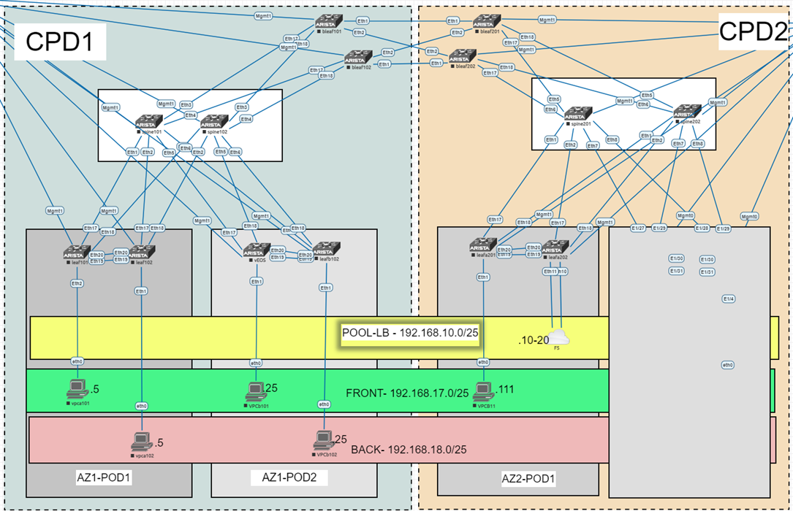

# Cloud and Devops Days

## Project

## Laboratory

The testing lab will be deployed within the staging workload domain and the 
following picture represent the current the logical topology:

### Requirements

Arista Networks supports Ansible for managing devices running the EOS operating 
system natively through eAPI or CloudVision Portal (CVP). This collection 
includes a set of ansible roles and modules to help kick-start the deployments. 
The various roles and templates provided are designed to be customized and 
extended based on the specific needs.

Full documentation for the collection is available on read-the-docs: 
[AVD Repo](https://avd.sh/en/latest/index.html)

### EVE-NG Network simulator

The following diagram represents the network physical elements that will be 
part of the EVPN fabric deployment and the testcase scenario for OHE Dallas.

### Github

Documentation, templates and playbooks will be hosted in the following git 
repositories:

Note: Login to GitHub with your N or X credentials. If you cannot login due to 
invalid permissions. Please, open a ticket on the following service now path.

  • General.
  • Onboarding user.
  • Add user.
  • Parameter1: Follow the help example guide.
  • ParameterCombo2: Git.

## Lab Environment

### AZ1 DOCUMENTATION

- [AZ1 DOCUMENTATION](doc/fabric/AZ1-documentation.md)

#### Devices

- [SPINE101](doc/devices/SPINE101.md)
- [SPINE102](doc/devices/SPINE102.md)
- [LEAF101](doc/devices/LEAF101.md)
- [LEAF102](doc/devices/LEAF102.md)
- [LEAFB101](doc/devices/LEAFB101.md)
- [LEAFB102](doc/devices/LEAFB102.md)
- [BLEAF101](doc/devices/BLEAF101.md)
- [BLEAF102](doc/devices/BLEAF102.md)

### AZ2 DOCUMENTATION

- [AZ1 DOCUMENTATION](doc/fabric/AZ2-documentation.md)

#### Devices AZ2

- [SPINE201](doc/devices/SPINE201.md)
- [SPINE202](doc/devices/SPINE202.md)
- [LEAFA201](doc/devices/LEAFA201.md)
- [LEAFA202](doc/devices/LEAFA202.md)
- [BLEAF201](doc/devices/BLEAF201.md)
- [BLEAF202](doc/devices/BLEAF202.md)

## LAST CHANGES:

- [BLEAF101](doc/devices/compare/BLEAF101.html)
- [BLEAF102](doc/devices/compare/BLEAF102.html)
- [BLEAF201](doc/devices/compare/BLEAF201.html)
- [BLEAF202](doc/devices/compare/BLEAF202.html)
- [LEAF101](doc/devices/compare/LEAF101.html)
- [LEAF102](doc/devices/compare/LEAF102.html)
- [LEAFA201](doc/devices/compare/LEAFA201.html)
- [LEAFA202](doc/devices/compare/LEAFA202.html)
- [LEAFB101](doc/devices/compare/LEAFB101.html)
- [LEAFB102](doc/devices/compare/LEAFB102.html)
- [SPINE101](doc/devices/compare/SPINE101.html)
- [SPINE102](doc/devices/compare/SPINE102.html)
- [SPINE201](doc/devices/compare/SPINE201.html)
- [SPINE202](doc/devices/compare/SPINE202.html)

## FAQ

Below is described the work structure used on the git repo:

  • A folder for all your inventories with one sub-folder per inventory. An 
  inventory folder contains all your variables for a given environment 
  like host_vars, group_vars, inventory.yml
  • A folder to store all playbooks. So it is easy to reuse playbooks whatever 
  the inventory is (if you use a coherent syntax)
  • ansible.cfg at the root of this repository

<pre><code>
    |------ inventory
    |       ├    group_vars
    |       ├    host_vars
    |       └-   inventoy.yml
    g└------ playbooks
</code></pre>
